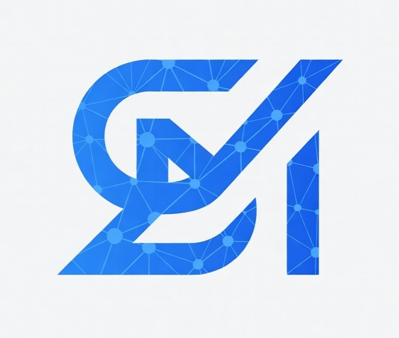

# Solving Minds

Next-gen study environment for JEE / NEET aspirants. Track progress, solve PYQs, and connect with your community.



## Features

- **Command Center**: Daily performance tracking, streak monitoring, and advanced analytics.
- **JEE / NEET Solver**: High-fidelity UI for solving previous year questions with immediate feedback.
- **Community Protocol**: Share posts, track leaderboard rankings, and engage with peers.
- **System Alerts**: Real-time push notifications via Firebase Cloud Messaging.

## Getting Started

First, install dependencies and run the development server:

```bash
npm install
npm run dev
```

Open [http://localhost:3000](http://localhost:3000) with your browser to see the dashboard.

## Environment Variables

Make sure to set up your `.env.local` file with the required Supabase and Firebase credentials before running the application.

## 🤝 Contributors

- **Satyam Jha** - Lead Developer & Visionary
- **Antigravity (Google DeepMind)** - AI Pair Programmer & Code Architect 🤖✨
